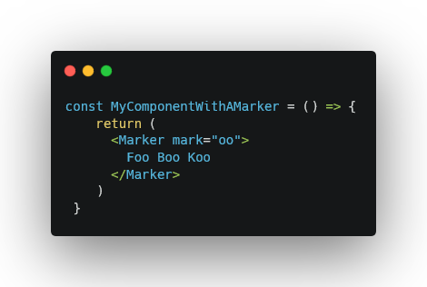

# React Mark JS (Inspired by [mark.js](https://markjs.io))

## Marking a String
```js
import Mark from 'react-mark.js'
// OR
import {Mark} from 'react-mark.js/dist/components/Mark'

const MyComponents = () => {


  return (
    <Mark
      mark="o"
      type="mark"
    >
      Hello World
    </Mark>
  )
}
```


## Marking a Regular Expression (RegEx)
```js
import Mark from 'react-mark.js'
// OR
import {Mark} from 'react-mark.js/dist/components/Mark'

const MyComponents = () => {

  return (
    <Mark
      mark={/l/}
      type="markRegExp"
    >
      Hello World
    </Mark>
  )
}
```

## Marking a Range
```js
import Mark from 'react-mark.js'
// OR
import {Mark} from 'react-mark.js/dist/components/Mark'

const MyComponents = () => {

  return (
    <Mark
      mark={[
        {
          length: 3,
          start: 1
        },
        {
          length: 4,
          start: 6
        }
      ]}
      type="markRanges"
    >
      0123456789
    </Mark>
  )
}
```
